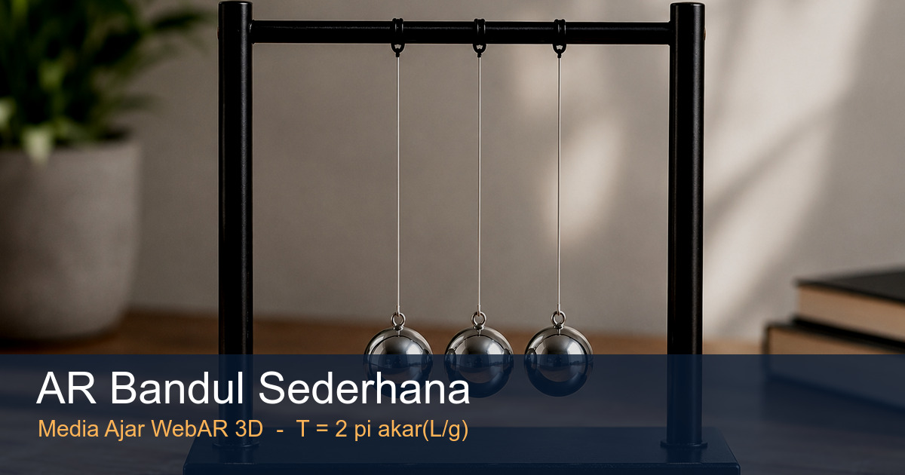

<p align="center">
  
</p>

<h1 align="center">🕰️ AR Bandul Sederhana</h1>

<p align="center">
  <b>Media pembelajaran berbasis Augmented Reality untuk memvisualisasikan gerak bandul sederhana (simple pendulum) secara 3D — langsung dari browser HP, tanpa instal aplikasi.</b>
</p>

<p align="center">
  <a href="https://chensqy.my.id/"><b>🚀 Buka Demo Langsung</b></a>
</p>

<p align="center">
  
  
  
</p>

---

## Tentang

Proyek ini dibuat sebagai **media ajar untuk sidang skripsi**. Pengguna memindai
sebuah **marker cetak** (kartu bergambar alat bandul), lalu muncul alat bandul 3D
yang **berayun sesuai fisika sungguhan** di atas kartu. Panjang tali di layar
sebanding dengan panjang tali sebenarnya (dalam meter), sehingga periode ayunan yang
terlihat konsisten dengan rumus yang ditampilkan.

## Konsep — gerak A · B · C

Sesuai diagram penelitian: **satu bandul berayun** bolak-balik melewati tiga posisi
yang diberi label langsung di objek 3D:

| Posisi | Letak | Yang terjadi |
|---|---|---|
| **A** | simpangan **kiri** | beban di titik terjauh kiri — sesaat berhenti, lalu berbalik |
| **B** | **tengah / bawah** | titik setimbang (terendah) — beban bergerak **paling cepat** |
| **C** | simpangan **kanan** | beban di titik terjauh kanan — sesaat berhenti, lalu berbalik |

Satu ayunan penuh = **A → B → C → B → A**. Label posisi **menyala** saat beban
melewatinya, dan panel angka menampilkan live posisi, sudut θ, panjang tali L, serta
periode `T = 2π√(L/g)`. Tombol **?** di layar menampilkan penjelasan lengkap gerak A–B–C
(berguna saat presentasi).

## Tiga mode demo (ganti saat AR live)

| Mode | Materi | Yang ditampilkan |
|---|---|---|
| **Gerak A–B–C** | Bandul sederhana / GHS | Satu bandul berayun; posisi A (kiri) · B (tengah) · C (kanan), readout θ/L/T |
| **Gelombang Bandul** | Superposisi & fase | 9 bandul beda panjang → periode beda → pola merambat & bergantian (pendulum wave) |
| **Ayunan Newton** | Kekekalan momentum & energi | Deret bola, tumbukan lenting; bola ujung memantul bergantian |

Saat AR: **putar objek dengan 1 jari**, **zoom dengan 2 jari**, tombol **Reset 3D**, HUD penjelasan
on-screen, dan panel **📖 Penjelasan** berisi 7 tab materi. Bisa dipakai **tegak maupun landscape**.

## Cara pakai

1. **Cetak marker**: bisa **beberapa foto sekaligus** (mis. `media/marker-bandul.png`,
   `media/bandul-1..4.png`, dan diagram `media/bandul-5.png` / `media/bandul-6.png`) — semuanya bisa dipindai.
   Cetak di kertas / tempel di karton.
2. Buka situs ini di **browser HP** (Chrome/Safari), izinkan akses kamera.
3. Tekan **Mulai** di menu pembuka → arahkan kamera ke **salah satu foto** → bandul 3D muncul di atasnya.
4. Gerakkan HP mengelilingi marker untuk melihat dari berbagai sudut.

> Beberapa foto didukung sekaligus lewat **multi-marker** (satu `targets.mind` berisi banyak foto).
> Detail cara compile ada di [PANDUAN.md](./PANDUAN.md).

> Kamera web butuh **HTTPS** — jalan otomatis di GitHub Pages / hosting mana pun; untuk uji lokal lihat [PANDUAN.md](./PANDUAN.md).

## Fisika singkat

Bandul sederhana untuk simpangan kecil (θ ≲ 15°) mengikuti Gerak Harmonik Sederhana:

```
T = 2π √(L / g)
```

- `T` = periode (detik) — waktu satu ayunan penuh
- `L` = panjang tali (meter)
- `g` = percepatan gravitasi (≈ 9,8 m/s²)

Periode **tidak** bergantung pada massa beban maupun (untuk sudut kecil) besar simpangan.

## Struktur berkas

```
chensqy/
├── index.html        UI: menu Mulai, panel penjelasan (?), scene A-Frame + MindAR
├── targets.mind      Target image-tracking (7 foto hasil kompilasi) — lihat PANDUAN.md
├── CNAME             Domain kustom: chensqy.my.id
├── 404.html          Halaman 404
├── .nojekyll         Nonaktifkan Jekyll (GitHub Pages)
├── js/
│   └── pendulum.js   Komponen <a-entity pendulum-lab>: rangka + bandul 3D berayun, posisi A/B/C, fisika, label
├── assets/           Ikon situs + logo + gambar pratinjau (favicon, logo, og-image)
├── vendor/           A-Frame + MindAR (self-hosted)
└── media/            Bahan cetak marker: marker-bandul.png + bandul-1..4.png + bandul-5/6.png (diagram A/B/C)
```

## Deploy & domain

Proyek ini **berdiri sendiri** (terpisah dari media AR lain) dan disiapkan untuk
**repo + domain sendiri**. Detail langkah ada di [PANDUAN.md](./PANDUAN.md).

## Lisensi

MIT © Ksatria Bintang Samudra
